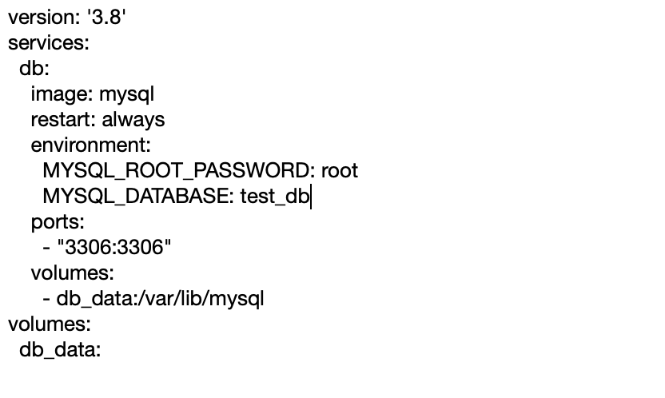

# Binding Named Volumes

Named volumes can persist data after we restart or remove a container. Also, it’s accessible by other containers.&#x20;

For example:



Here, the first field is a unique name of the volume on a host machine. The second field is the path in the container.

Following are the  changes we have to do while mounting the volume for ingestion in OpenMetadata

1. Update or add the volume in the docker-compose.yml file:

```
nano OpenMetadata/docker/local-metadata/docker-compose.yml
or
nano OpenMetadata/docker/metadata/docker-compose.yml
```

Firstly, define the volumes at the top level of the file.

```
volumes:
  ingestion-volume-dag-airflow:
  ingestion-volume-dags:
  ingestion-volume-tmp:
```

Then add this in the ingestion service:

```
- ingestion-volume-dag-airflow:/airflow/dag_generated_configs
- ingestion-volume-dags:/airflow/dags
- ingestion-volume-tmp:/tmp
```

Once these changes are done, you can run run\_local\_docker.sh script on terminal

```
./run_local_docker.sh
```

## Alternative Method 1

Alternatively, you can use the docker-compose method:

### Navigate into the docker directory inside OpenMetadata

```
cd docker
```

### Navigate into the local-metadata directory inside the docker

```
cd local-metadata
```

### Start the Docker Containers

```
docker compose up
```

This will create a docker network and four containers for the following services:

* MySQL to store the metadata catalog
* Elasticsearch to maintain the metadata index which enables you to search the catalog
* Apache Airflow which OpenMetadata uses for metadata ingestion
* The OpenMetadata UI and API server

After starting the Docker containers, you should see an output similar to the following.

```
[+] Running 5/5
 ⠿ Network ometa_network                 Created                                                                                                                                                       0.1s
 ⠿ Container openmetadata_elasticsearch  Created                                                                                                                                                       0.2s
 ⠿ Container openmetadata_mysql          Created                                                                                                                                                       0.1s
 ⠿ Container openmetadata_ingestion      Created                                                                                                                                                       0.1s
 ⠿ Container openmetadata_server         Created                                                                                                                                                       0.1s
Attaching to openmetadata_elasticsearch, openmetadata_ingestion, openmetadata_mysql, openmetadata_server
```

Once the containers up and running, it will launch Airflow tasks to ingest sample metadata and usage data to experiment with. This might take several minutes, depending on your system.

### Verify all containers are up and running&#x20;

```
docker ps 
```

After running the above command, you'll see an output similar to the following.

```
CONTAINER ID   IMAGE                                                  COMMAND                  CREATED             STATUS                       PORTS                                                  NAMES
7f031f096966   local-metadata_openmetadata-server                     "./openmetadata-star…"   About an hour ago   Up About an hour             3306/tcp, 9200/tcp, 9300/tcp, 0.0.0.0:8585->8585/tcp   openmetadata_server
6f7992e02314   local-metadata_ingestion                               "./ingestion_depende…"   About an hour ago   Up About an hour             0.0.0.0:8080->8080/tcp                                 openmetadata_ingestion
ca8e590de33f   local-metadata_mysql                                   "/entrypoint.sh mysq…"   About an hour ago   Up About an hour (healthy)   0.0.0.0:3306->3306/tcp, 33060-33061/tcp                openmetadata_mysql
1f037580731e   docker.elastic.co/elasticsearch/elasticsearch:7.10.2   "/tini -- /usr/local…"   About an hour ago   Up About an hour             0.0.0.0:9200->9200/tcp, 0.0.0.0:9300->9300/tcp         openmetadata_elasticsearch
```

## Alternative Method 2

You can use the Python packages

### Activate the virtual environment

```
source env/bin/activate
```

### Upgrade pip and setup-tools

```
pip3 install --upgrade pip setuptools
```

### Install the OpenMetadata Python module using pip

```
pip3 install --upgrade 'openmetadata-ingestion[docker]'
```

### Ensure the module is installed and ready for use

```
metadata docker --help
```

After running the command above, you should see output similar to the following.

```
Usage: metadata docker [OPTIONS]

  Checks Docker Memory Allocation Run Latest Release Docker - metadata
  docker --run Run Local Docker - metadata docker --run -t local -p
  path/to/docker-compose.yml

Options:
  --start          Start release Docker containers
  --stop           Stop Docker containers (local and release)
  --clean          Prune unused containers, images, volumes and networks
  -t, --type TEXT  'local' - local type will start local build of OpenMetadata
                   docker

  -p, --path FILE  Path to Local docker-compose.yml
  --help           Show this message and exit.
```

### Start the OpenMetadata Docker containers

```
metadata docker --start
```

This will create a docker network and four containers for the following services:

* MySQL to store the metadata catalog
* Elasticsearch to maintain the metadata index which enables you to search the catalog
* Apache Airflow which OpenMetadata uses for metadata ingestion
* The OpenMetadata UI and API server

After starting the Docker containers, you should see an output similar to the following.

```
[2021-11-18 15:53:52,532] INFO     {metadata.cmd:202} - Running Latest Release Docker
[+] Running 5/5
 ⠿ Network tmp_app_net                  Created                                                                                                                                          0.3s
 ⠿ Container tmp_mysql_1                Started                                                                                                                                          1.0s
 ⠿ Container tmp_elasticsearch_1        Started                                                                                                                                          1.0s
 ⠿ Container tmp_ingestion_1            Started                                                                                                                                          2.1s
 ⠿ Container tmp_openmetadata-server_1  Started                                                                                                                                          2.2s
[2021-11-18 15:53:55,876] INFO     {metadata.cmd:212} - Time took to get containers running: 0:00:03.124889
.......
```

### Verify the Named Volumes

```
docker volume ls
```

This will list all the volumes which are available on the host machine.

The default path where volumes get created in Linux is as follows:

```
/var/lib/docker/volumes/
```
