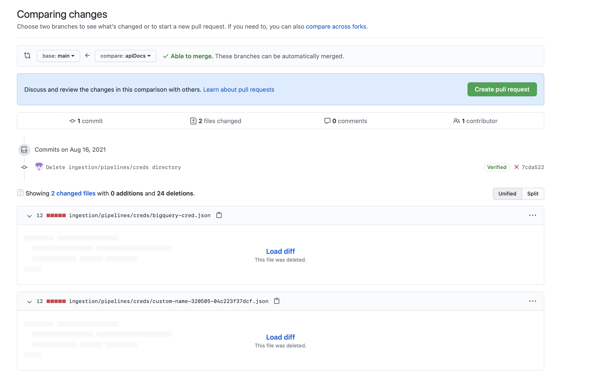

# How to Contribute

Welcome to [OpenMetadata](https://open-metadata.org). Our goal is to build an Open standard for Metadata. We genuinely believe this mission can only be achieved through building a great community.

We ❤️ all contributions, big and small!

## Github issues

Look for issues under [Github/issues tab](https://github.com/open-metadata/OpenMetadata/issues). If you have a feature request or found a bug please file an issue. This will help us track and will help the community overall as well.


## Fork Github project

OpenMetadata Github repository can be accessed here [https://github.com/open-metadata/OpenMetadata](https://github.com/open-metadata/OpenMetadata).

.png>)

Create a local clone of your fork

```bash
git clone https://github.com/<username>/OpenMetadata.git
```

Set a new remote repository that points to the OpenMetadata repository to pull changes from the open-source OpenMetadata codebase into your clone

```bash
cd OpenMetadata/
git remote add upstream https://github.com/open-metadata/OpenMetadata.git
git remote -v
```

## Create a branch in your fork

```bash
git checkout -b ISSUE-200
```

Make changes. Follow the [Coding Style](https://github.com/open-metadata/OpenMetadata/blob/main/docs/open-source-community/developer/docs/open-source-community/developer/backend/coding-style.md) Guide on best practices and [Build the code & run tests](broken-reference/) on how to set up IntelliJ, Maven.

## Push your changes to Github

```bash
git add .
git commit -m "ISSUE-200: Meaningful commit message"
git push origin HEAD:refs/heads/issue-200
```

## Open a PR

1. Go to [https://github.com/open-metadata/OpenMetadata/pulls](https://github.com/open-metadata/OpenMetadata/pulls)
2. It should show an option to open a pull request. 
3.  If not, click on "New Pull request"

    
4. Select your fork repository and branch 
5. Click "Create pull request"

## We are here to help

Please reach out to us anytime you need any help. [Slack](https://slack.open-metadata.org) would be fastest way to get a response.
