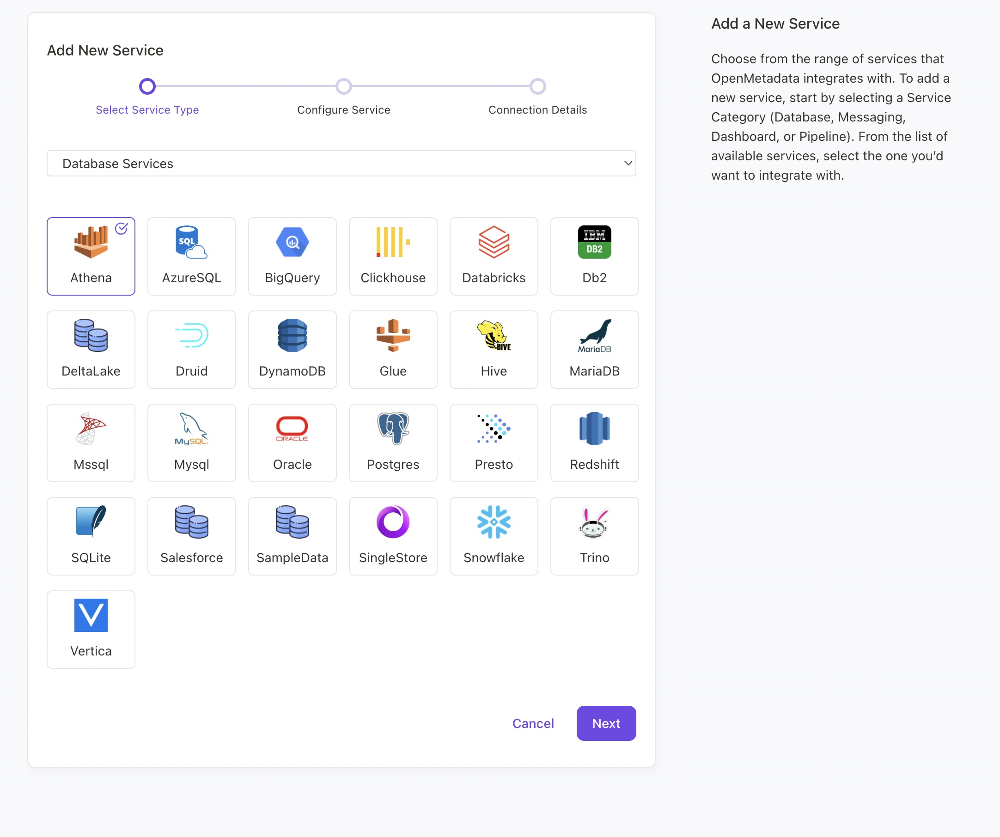
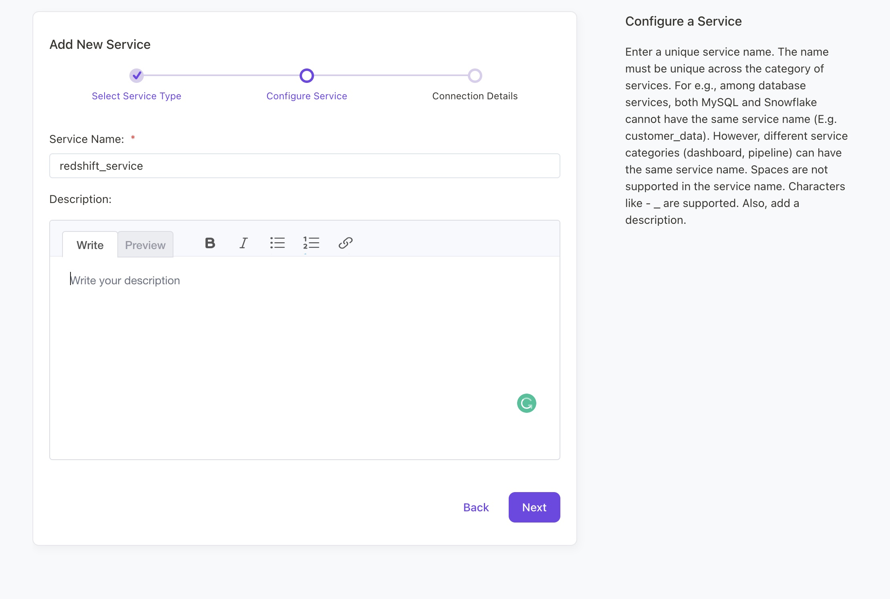
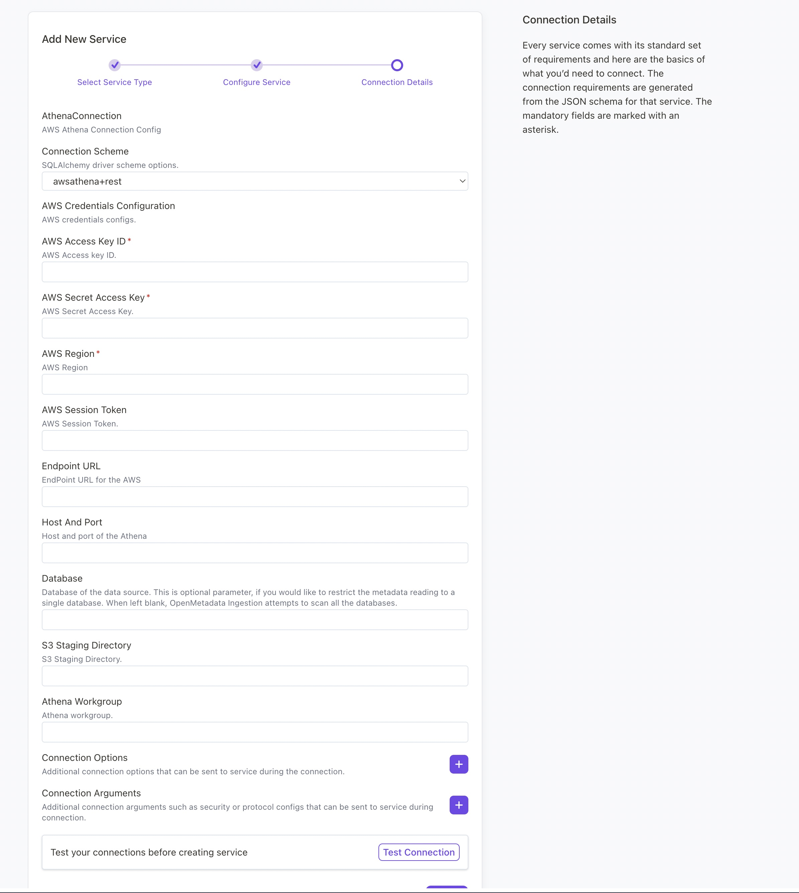

# Athena

Configure and schedule Athena **metadata**,  and **profiler** workflows from the OpenMetadata UI.

* [Requirements](./#requirements)
* [Metadata Ingestion](./#metadata-ingestion)
* [Query Usage and Lineage Ingestion](./#query-usage-and-lineage-ingestion)
* [Data Profiler and Quality Tests](./#data-profiler-and-quality-tests)
* [DBT Integration](./#dbt-integration)

If you don't want to use the OpenMetadata Ingestion container to configure the workflows via the UI, then you can check the following docs to connect using Airflow SDK or with the CLI.

## Requirements

#### **OpenMetadata (version 0.10 or later)**

To deploy OpenMetadata, follow the procedure [Try OpenMetadata in Docker](../../../overview/run-openmetadata/).

To run the Ingestion via the UI you'll need to use the OpenMetadata [Ingestion Container](https://hub.docker.com/r/openmetadata/ingestion), which comes shipped with custom Airflow plugins to handle the workflow deployment.

## Metadata Ingestion

### 1. Visit the _Services_ Page

The first step is ingesting the metadata from your sources. Under Settings you will find a **Services** link an external source system to OpenMetadata. Once a service is created, it can be used to configure metadata, usage, and profiler workflows.

To visit the _Services_ page, select _Services_ from the _Settings_ menu.&#x20;

 (1).png>)

### 2. Create a New Service

Click on the _Add New Service_ button to start the Service creation.

.png>)

### 3. Select the Service Type

Select Athena as the service type and click _Next_.

### 4.Name and Describe your Service

Provide a name and description for your service as illustrated below.

#### Service Name

OpenMetadata uniquely identifies services by their _Service Name_. Provide a name that distinguishes your deployment from other services, including the other Athena services that you might be ingesting metadata from.

#### Description

Provide a description for your Athena service that enables other users to determine whether it might provide data of interest to them.

### 5. Configure the Service Connection

In this step, we will configure the connection settings required for this connector. Please follow the instructions below to ensure that you've configured the connector to read from your Redshift service as desired.

 (2).png>)

### 6. Configure the Metadata Ingestion

Once the service is created, we can add a **Metadata Ingestion Workflow**, either directly from the _Add Ingestion_ button in the figure above, or from the Service page:

.png>)

#### Include (Table Filter Pattern)

Use table filter patterns to control whether or not to include tables as part of metadata ingestion and data profiling.

Explicitly include tables by adding a list of comma-separated regular expressions to the _Include_ field. OpenMetadata will include all tables with names matching one or more of the supplied regular expressions. All other tables will be excluded. See the figure above for an example.

#### Exclude (Table Filter Pattern)

Explicitly exclude tables by adding a list of comma-separated regular expressions to the _Exclude_ field. OpenMetadata will exclude all tables with names matching one or more of the supplied regular expressions. All other tables will be included. See the figure above for an example.

#### Include (Schema Filter Pattern)

Use schema filter patterns to control whether or not to include schemas as part of metadata ingestion and data profiling.

Explicitly include schemas by adding a list of comma-separated regular expressions to the _Include_ field. OpenMetadata will include all schemas with names matching one or more of the supplied regular expressions. All other schemas will be excluded.

#### Exclude (Schema Filter Pattern)

Explicitly exclude schemas by adding a list of comma-separated regular expressions to the _Exclude_ field. OpenMetadata will exclude all schemas with names matching one or more of the supplied regular expressions. All other schemas will be included.

**Include views (toggle)**

Set the _Include views to_ toggle to the on position to control whether or not to include views as part of metadata ingestion and data profiling.

Explicitly include views by adding the following key-value pair in the `source.config` field of your configuration file.

**Enable data profiler (toggle)**

The data profiler ingests usage information for tables. This enables you to assess the frequency of use, reliability, and other details.

When enabled, the data profiler will run as part of metadata ingestion. Running the data profiler increases the amount of time it takes for metadata ingestion but provides the benefits mentioned above.

Set the _Enable data profiler_ toggle to the on position to enable the data profiler.

**Ingest sample data (toggle)**

Set the _Ingest sample data to_ toggle to the on position to control whether or not to generate sample data to include in table views in the OpenMetadata user interface.

### 7. Schedule the Ingestion and Deploy

Scheduling can be set up at an hourly, daily, or weekly cadence. The timezone is in UTC. Select a Start Date to schedule for ingestion. It is optional to add an End Date.

Review your configuration settings. If they match what you intended, click _Deploy_ to create the service and schedule metadata ingestion.

If something doesn't look right, click the _Back_ button to return to the appropriate step and change the settings as needed.

.png>)

### 8. View the Ingestion Pipeline

Once the workflow has been successfully deployed, you can view the Ingestion Pipeline running from the Service Page.

 (1).png>)

### 9. Workflow Deployment Error

If there were any errors during the workflow deployment process, the Ingestion Pipeline Entity will still be created, but no workflow will be present in the Ingestion container.

You can then edit the Ingestion Pipeline and _Deploy_ it again.

.png>)

From the _Connection_ tab, you can also _Edit_ the Service if needed.

##
