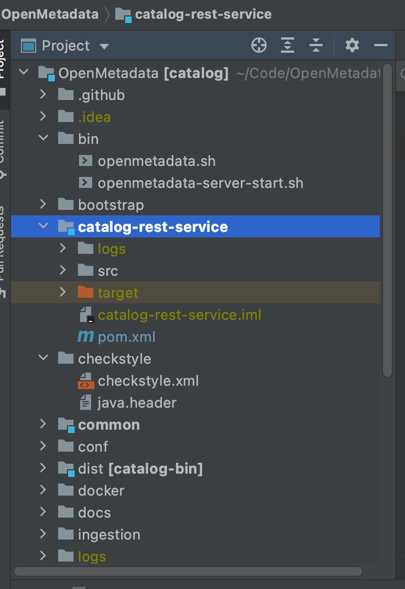
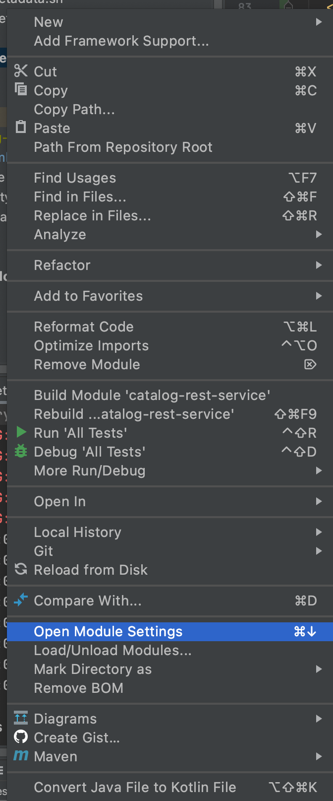
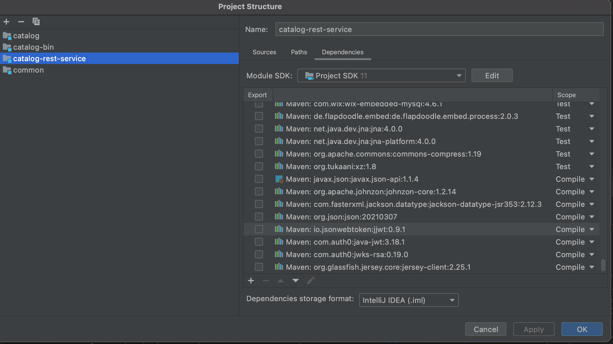
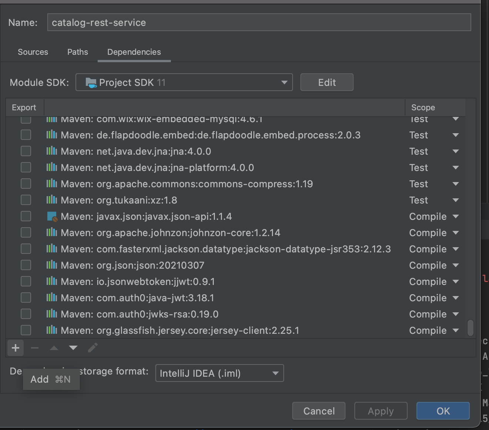

# Build the code & run tests

## Prerequisites

First of all, you need to make sure you are using maven 3.5.x or higher and JDK 11 or higher.

## Building

The following commands must be run from the top-level directory.

`mvn clean install`

If you wish to skip the unit tests you can do this by adding`-DskipTests`to the command line.

## Create a distribution (packaging)

You can create a _distribution_ as follows.

```
$ mvn clean install

# Create the binary distribution.
$ cd dist && mvn package
```

The binaries will be created at:

```
dist/target/open-metadata-<version>.pom
dist/target/open-metadata-<version>.tar.gz
```

## Run instance through IntelliJ IDEA

Add a new Run/Debug configuration like the below screenshot.

.png>)

## Add missing dependency

Right-click on catalog-rest-service



Click on "Open Module Settings"



Go to "Dependencies"



Click “+” at the bottom of the dialog box and click "Add"



Click on Library


In that list look for "jersey-client:2.25.1"


Select it and click "OK". Now run/debug the application.

## Coding Style

1. [Refer to coding guidelines](coding-style.md)
2.  Configure IntelliJ to disable the \[wild-card imports]

    ([https://www.jetbrains.com/help/idea/creating-and-optimizing-imports.html#disable-wildcard-imports](https://www.jetbrains.com/help/idea/creating-and-optimizing-imports.html#disable-wildcard-imports))
