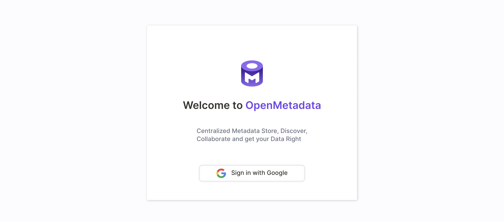
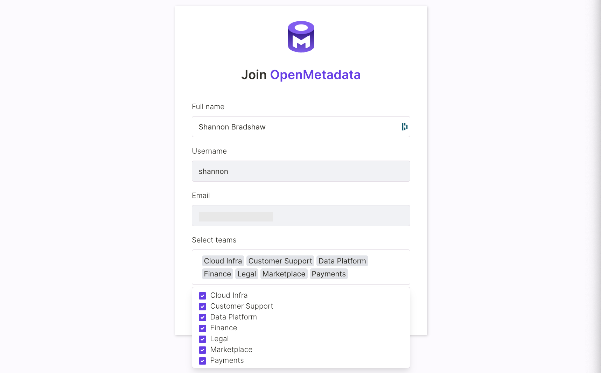
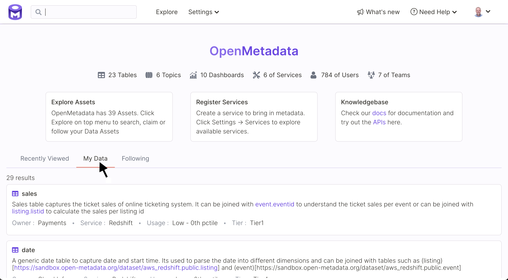
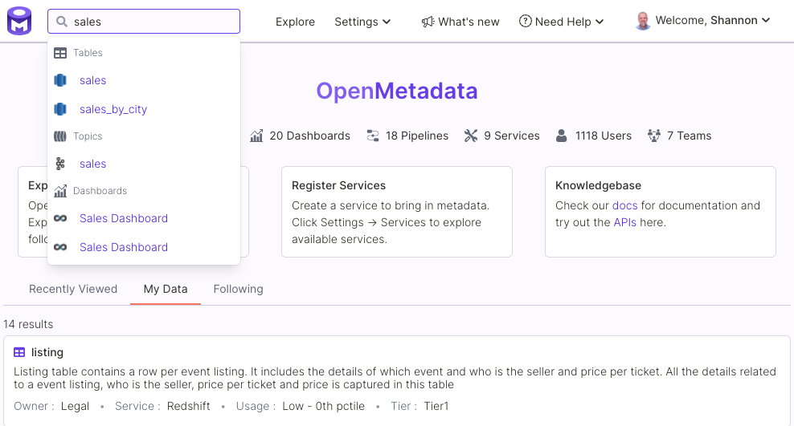
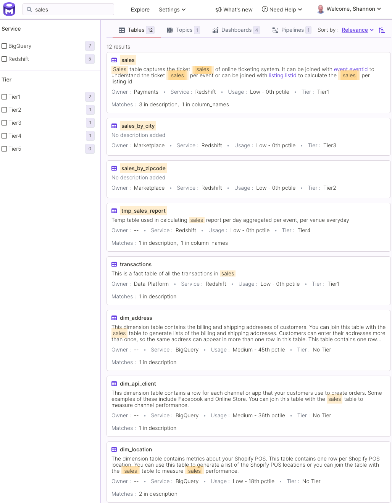
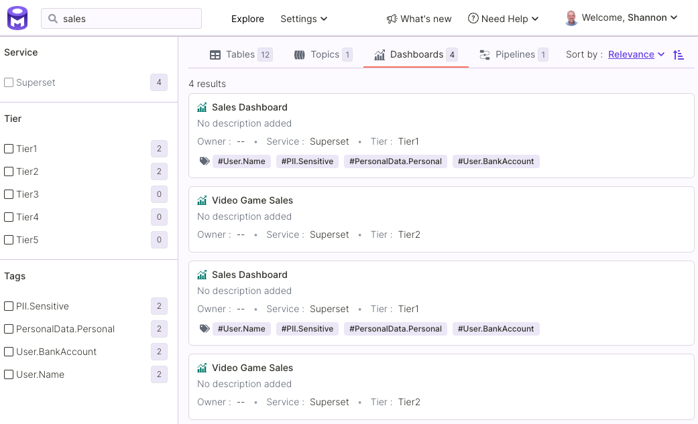
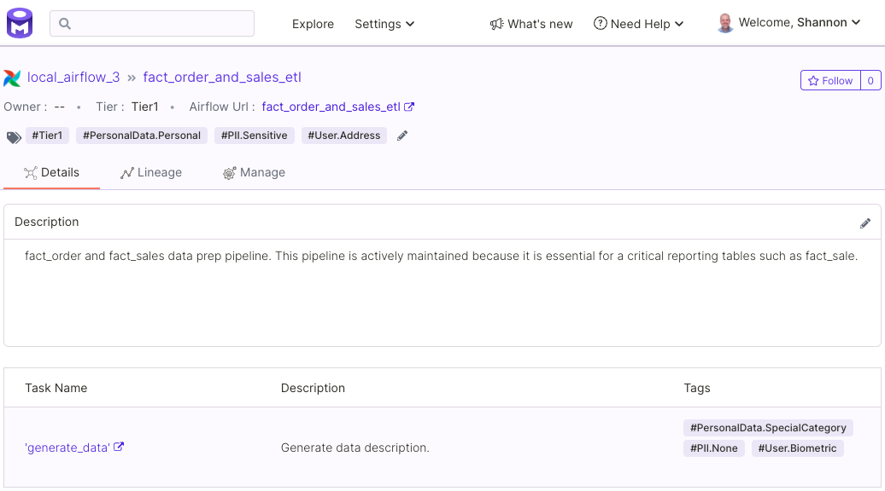
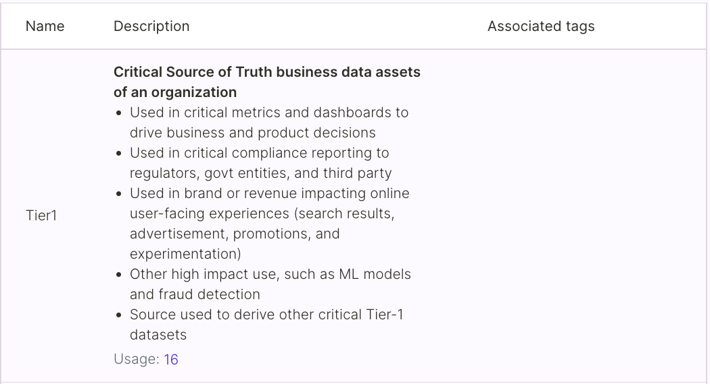
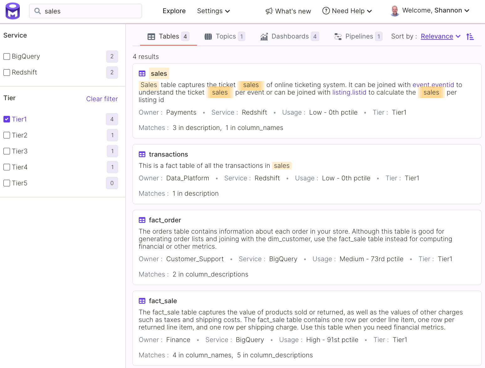

# Tutorial: Data Discovery with OpenMetadata

In this tutorial, we will explore key features of the OpenMetadata standard and Discovery and Collaboration User Interface. Specifically, we will demonstrate how to:

* Find data using keyword search across services, databases, tables, tags, etc.
* Use tags to identify the relative importance of different datasets.
* Use data descriptions to distinguish the right data to use for your use case from among many possibilities.

For this tutorial, we will assume the role of data analysts who have been asked to analyze product sales by region. We will use the OpenMetadata sandbox. The sandbox is an environment in which you can explore OpenMetadata in the context of data assets and the metadata with which a community of users has annotated these resources.

.png>)

### **1. Log in to the OpenMetadata sandbox using a Google account**

Navigate to the [OpenMetadata sandbox](https://sandbox.open-metadata.org/signin) and log in using your Google account.

### 2. Add yourself as a user and add yourself to several teams

This is only necessary if you have previously logged in to OpenMetadata.

Once logged in, your view of the sandbox should look something like the figure below.

### 3. Search for "sales"

In the search box, enter the search term, sales. OpenMetadata will perform the search across all assets, regardless of type, and retrieve those that match by name or based on the text of metadata associated with that asset.

Note that as we type the search term sales, OpenMetadata auto-suggests a number of matching assets categorized by type in a dropdown just below the search box. In this case, there are assets of type Table, Topic, and Dashboard displayed. See the figure below for an example. OpenMetadata search also looks for pipelines, column names, tags, and other assets matching your query. Keyword search is, therefore, a powerful tool for locating relevant assets.

### 4. Explore the search results: Tables, Dashboards, Pipelines

Having issued our search for sales, we see results similar to those depicted below. This query matches 12 tables across the BigQuery and Redshift services.

In addition, we’ve identified four dashboards...

...and an ETL pipeline for sales data.

### 5. Take note of descriptions and tags

As we look through all of this, it’s important to note the descriptions for these assets. For example, the _fact\_order\_and\_sales\_etl_ pipeline identifies the _fact\_sale_ table as a critical reporting table.

We also see tags that other users have applied to help identify data types of particular interest contained in each asset.

Finally, we see that some of the assets are identified with a tag specifying tiers ranging from Tier1 to Tier5. Tiers are a means of identifying the relative importance of assets.

### 6. View in-product documentation for Tiers

To learn more about Tiers and other tags, we can visit _Settings > Tags_.

Clicking _Tier_ from the _Tag Categories_ provides us with a description of the Tier tag type as well as a detailed description of each tier.

Note also that the description for each tier includes a _Usage_ label identifying the number of assets to which that tag has been applied. This number is linked to all assets tagged accordingly. Usage data is maintained for Tier tags and all other tags as well.

### 7. Focus on Tier1 (important) assets

In general, for analyses that will drive business decisions, we want to ensure that the data we are using is important and already being used to drive other decisions. As we saw in the previous step, Tier1 assets meet this criterion.

Based on our consideration of asset descriptions, tags, and tiers, we now have a better sense for how to locate the data we need in order to perform an analysis of sales by region\*\*.\*\*

Let’s go back to the tables tab in our search results since that’s where we’ll find the source data we need. Looking at the options for filtering search results, we can select Tier1 to limit results to just the most important tables among the assets matching our query.

### 8. Sort by usage frequency

In addition to tiers, another determiner of importance is how frequently a table is used. The OpenMetadata search UI enables us to sort results by weekly usage. Let’s go ahead and do that.

### 9. Limit consideration to high usage, Tier1 assets

Having sorted the Tier1 assets, we can see that there are probably only two tables that warrant further consideration: _fact\_sale_ and _fact\_order_. Both of these tables are roughly among the top quarter of the most frequently used tables. Based on their names, either could serve our purpose so we’ll need to dig deeper.

.png>)

### 10. Use descriptions to distinguish between candidate assets

At this point, we can see that we’ll need to compare _fact\_sale_ and _fact\_order_ to determine which best suits our needs. Looking at the descriptions for each table we see a couple of statements that help clarify which table we should use.

First from the _fact\_sale_ description we see a statement that indicates that we should use _fact\_sale_.

Then from the _fact\_order_ description we see a statement that directs us to use the _fact\_sale_ table when computing financial metrics.

As further evidence, if you’ll recall, the description of the _fact\_order\_and\_sales\_etl_ pipeline that we reviewed in step 5 above also calls out the use of _fact\_sale_ for critical reporting.

Taken together, the Tier1 designation, the frequency of use, and the direction we’ve gleaned from three asset descriptions provides a high degree of confidence that _fact\_sale_ is the right table for us to use.

In the next tutorial, we will explore how to assess an asset to learn what we need to know about the individual fields, related tables and other assets, and how to get help with specific questions about the asset.

**Thanks for following along with this introduction to OpenMetadata! Have questions? Please join the** [**OpenMetadata Slack**](https://slack.open-metadata.org)**. We have an active and engaged community that is ready to help!**
